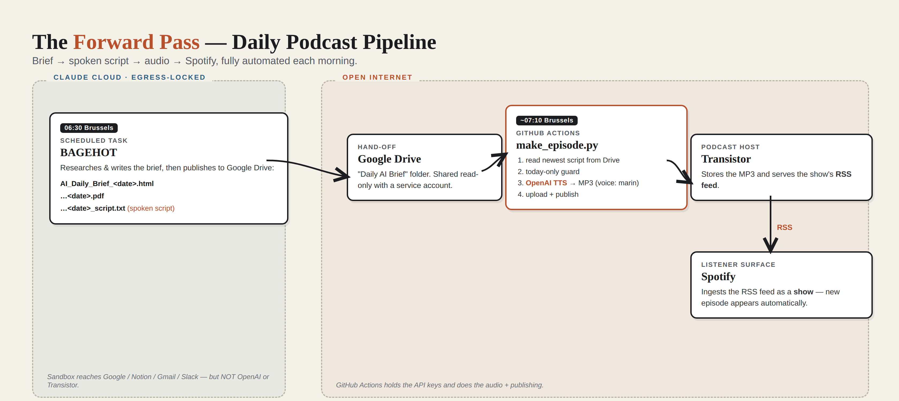

# The Forward Pass — Podcast · Operations Runbook (Daily + Weekly)

> Two pipelines share this repo and its secrets: the **daily** brief podcast (§1–§13,
> `make_episode.py`) and the **~20-min weekly two-host podcast** (§14, `make_weekly_episode.py`).

**Owner:** Fred Munster (munster.fred@gmail.com) · **Product:** AI Cure Newsroom
**Last updated:** 2026-09-18 · **Status:** Live

This document describes the fully automated pipeline that turns the daily
**AI Daily Brief** into an audio episode published to **Spotify**. It covers the
architecture, configuration, day-to-day operations, troubleshooting, and recovery.

---

## 1. What it does (one paragraph)

Every morning, the existing **BAGEHOT** scheduled task writes the day's brief (HTML + PDF)
**and a purpose-built spoken script** to a Google Drive folder. A **GitHub Actions** job then
picks up that script, renders it to audio with **OpenAI text-to-speech**, and publishes it as an
episode to **Transistor** (the podcast host). Transistor's RSS feed is registered with **Spotify**,
so the new episode appears in the show automatically. No human action is required day to day.

---

## 2. Architecture



```
06:30 Brussels          ~07:10 Brussels
┌───────────────┐       ┌──────────────────────────────────────────────┐
│ BAGEHOT task  │       │ GitHub Actions: "Daily AI Brief Podcast"       │
│ (Claude cloud │       │  make_episode.py                               │
│  scheduled    │       │   1. read newest brief + script from Drive     │
│  task)        │       │   2. (today-only guard)                        │
│               │       │   3. OpenAI TTS  → MP3                          │
│  writes to    │──────▶│   4. upload + publish → Transistor             │
│  Google Drive │ Drive │                                                │
│  "Daily AI    │       └───────────────┬────────────────────────────────┘
│   Brief"      │                       │ RSS
│  - .html      │                       ▼
│  - .pdf       │                ┌──────────────┐      ┌───────────┐
│  - _script.txt│                │  Transistor  │─────▶│  Spotify  │
└───────────────┘                │  (host+RSS)  │ feed │  (show)   │
                                 └──────────────┘      └───────────┘
```

**Why two separate systems?** The Claude cloud sandbox that runs BAGEHOT has locked-down
network egress — it can reach Google/Notion/Gmail/Slack but **not** OpenAI or Transistor.
So audio generation and publishing must run somewhere with open internet: GitHub Actions.
Google Drive is the hand-off point between the two.

**Why podcast-first (not a Spotify playlist)?** Spotify does not allow uploading an MP3 into a
playlist. Self-published audio reaches Spotify only as a **show** via an RSS feed. Episodes can
later be added to a playlist manually if desired, but the show is the reliable delivery path.

---

## 3. Components & accounts

| Component | What it is | Where |
|---|---|---|
| **BAGEHOT task** | Claude scheduled task that writes the brief + script to Drive | Claude app → scheduled tasks · trigger id `trig_016dhi4hRzBsUq65bya5DoVk` · cron `30 4 * * *` UTC |
| **Google Drive folder** | "Daily AI Brief" — holds `.html`, `.pdf`, `_script.txt` | folder id `1v2w8Q56LpXPAmi3gXqwmaX6NVgBr3z00` |
| **Google service account** | Read-only Drive access for the runner | Google Cloud Console → IAM → Service Accounts |
| **GitHub repo** | Holds the runner + workflow | private repo `forwardpass-podcast` |
| **GitHub Actions** | Runs the pipeline daily | repo → Actions → "Daily AI Brief Podcast" |
| **OpenAI** | Script polish + TTS | api.openai.com (key in GitHub secret) |
| **Transistor** | Podcast host + RSS feed | transistor.fm |
| **Spotify** | Public/observer surface | Spotify for Creators |

---

## 4. Daily timeline

| Time (Brussels) | Actor | Action |
|---|---|---|
| 06:30 | BAGEHOT | Publishes brief HTML + PDF to Drive; writes `AI_Daily_Brief_<date>_script.txt` (STEP 2d); stages Gmail + Slack drafts |
| 07:10 | GitHub Actions (cron `10 5 * * *` UTC) | Runs `make_episode.py` |
| 07:10–07:13 | make_episode.py | Reads script from Drive → OpenAI TTS → MP3 → publishes to Transistor |
| within minutes–hours | Transistor → Spotify | New episode ingested into the show |

---

## 5. Repository contents

```
forwardpass-podcast/
├── make_episode.py                 # the runner (see §6)
└── .github/workflows/
    └── daily-podcast.yml           # schedule + secrets wiring
```

### 6. make_episode.py — what it does, step by step
1. **get_drive()** — authenticates to Google Drive read-only using the service-account JSON.
2. **newest_brief_html()** — finds the newest `AI_Daily_Brief_*.html` in the folder.
3. **today-only guard** — if that brief's date isn't today (Europe/Brussels), it exits without
   publishing, so a skipped BAGEHOT day never produces a duplicate. Override with `FORCE=1`.
4. **fetch_script_text()** — prefers BAGEHOT's `AI_Daily_Brief_<date>_script.txt`. If missing,
   falls back to **make_script()**, which asks GPT to turn the brief HTML into a spoken script.
5. **synth()** — OpenAI `gpt-4o-mini-tts` renders the script to MP3, chunked to stay under the
   4096-character per-request limit, with a dynamic "news-anchor" delivery instruction.
6. **publish()** — Transistor `authorize_upload` → PUT the MP3 → create episode → publish.

---

## 7. Configuration

### GitHub → Settings → Secrets and variables → Actions

**Secrets** (never printed; values known only to you):

| Secret | Value |
|---|---|
| `OPENAI_API_KEY` | OpenAI API key (rotate periodically) |
| `TRANSISTOR_API_KEY` | Transistor account API key |
| `TRANSISTOR_SHOW_ID` | Numeric show id (`curl -s https://api.transistor.fm/v1/shows -H "x-api-key: KEY"`) |
| `DRIVE_FOLDER_ID` | `1v2w8Q56LpXPAmi3gXqwmaX6NVgBr3z00` |
| `GOOGLE_SA_JSON` | Full service-account JSON (entire file contents) |

**Variables:**

| Variable | Value | Notes |
|---|---|---|
| `TTS_VOICE` | `marin` | Current voice. Options: `marin`, `cedar`, `verse`, `ballad`, `sage`, `coral`, `onyx`, `nova`, `ash`, `alloy`, `shimmer`, `echo`, `fable` |

### Schedule
`daily-podcast.yml` → `on.schedule.cron: "10 5 * * *"` (UTC) → ~07:10 Brussels. Keep it ~30–40 min
after the BAGEHOT run (`30 4 * * *` UTC).

---

## 8. Common operations

**Change the voice**
Repo → Settings → Variables → edit `TTS_VOICE`. No code change or redeploy. Takes effect next run.

**Test / publish on demand**
Repo → Actions → "Daily AI Brief Podcast" → **Run workflow**. Tick **force** to publish even if the
newest brief isn't today's (useful for testing off-hours).

**Change the audio style / length**
Two levers:
- *Delivery* (energy, pacing): the `instructions=` string in `synth()` inside `make_episode.py`.
- *Words* (script itself): **STEP 2d** in the BAGEHOT task prompt (word count, tone, intro/outro).
  Edit the scheduled task's prompt in the Claude app.

**Change the schedule**
Edit the cron in `daily-podcast.yml` and commit.

**Rotate the OpenAI key**
Create a new key in the OpenAI dashboard → update the `OPENAI_API_KEY` secret → revoke the old key.
Recommended every ~90 days, and immediately if a key is ever exposed.

**Update the runner code**
Edit `make_episode.py` in the repo (web editor or git) and commit — the next scheduled run uses it.

---

## 9. Monitoring & verification

- **Did it run?** Repo → Actions tab. Green = success. Each run's log shows: `Fetched …html`,
  `Using BAGEHOT spoken script …` (or the HTML fallback), `synth chunk N ok`,
  `Published Transistor episode <id>`.
- **Episode live?** Transistor dashboard → the show → episode list.
- **On Spotify?** Spotify for Creators, or the public show page (after first-show approval).
- **Skipped day?** Log says `Newest brief is <date> (not today …); skipping.` — expected when
  BAGEHOT didn't publish that day.

---

## 10. Troubleshooting

| Symptom (in the Actions log) | Cause | Fix |
|---|---|---|
| `Invalid value: ''. Supported values are: …` on `voice` | `TTS_VOICE` variable empty/unset | Set `TTS_VOICE` to a valid voice; code also falls back to `onyx` |
| `No brief HTML found in the Drive folder` | Folder not shared with the service account, or wrong `DRIVE_FOLDER_ID` | Share "Daily AI Brief" with the SA email (Viewer); check the secret |
| `HttpError 403` from Google | Drive API not enabled, or SA lacks access | Enable Drive API; re-share the folder |
| `Newest brief is <date>…; skipping` | Today-only guard: no brief for today | Expected if BAGEHOT skipped; use **force** to override |
| Transistor `401`/`403` | Bad/expired `TRANSISTOR_API_KEY` or wrong `TRANSISTOR_SHOW_ID` | Re-copy the key and show id |
| OpenAI `401` | Bad/rotated `OPENAI_API_KEY` | Update the secret |
| Episode published but not on Spotify | Show not yet approved, or ingestion delay | Confirm the RSS is submitted in Transistor → Distribution; wait (minutes–hours) |
| Voice sounds flat | Voice choice / instruction | Try `marin`/`cedar`/`verse`; strengthen `synth()` instruction; shorten STEP 2d sentences |

**Note on the Claude sandbox:** it cannot reach OpenAI or Transistor (locked egress). This is by
design — never try to move the TTS/publish steps into the BAGEHOT task; they must stay in GitHub Actions.

---

## 11. Cost (approximate)

| Item | Cost |
|---|---|
| OpenAI (script polish + TTS, ~6–7 min/day) | a few cents to ~$0.30/day |
| Transistor host | per plan (~$19/mo tier) |
| GitHub Actions (private repo, ~3 min/day) | within free minutes |
| Spotify | free |

---

## 12. Recovery & rollback

- **Pause the whole thing:** Repo → Actions → "Daily AI Brief Podcast" → **⋯ → Disable workflow**.
  (BAGEHOT keeps producing the brief; only the podcast stops.)
- **Unpublish a bad episode:** delete/unpublish it in the Transistor dashboard; it drops from the
  RSS feed and (after re-ingestion) from Spotify.
- **Revert code:** restore a previous commit of `make_episode.py` in GitHub.
- **Turn off the script upgrade only:** remove STEP 2d from the BAGEHOT prompt — the runner then
  auto-falls back to generating the script from the HTML.

---

## 13. Reference IDs (non-secret)

- Drive folder "Daily AI Brief": `1v2w8Q56LpXPAmi3gXqwmaX6NVgBr3z00`
- Drive folder "Weekly AI Journal": `1YF23oNpM807KO-cQizSUjSDvl882J8H7`
- BAGEHOT task (trigger): `trig_016dhi4hRzBsUq65bya5DoVk` · cron `30 4 * * *` UTC
- Weekly Issue task (trigger): `trig_01DzMaT7usQR4NrynmJLZVpX` · cron `0 16 * * 0` UTC
- Daily podcast workflow cron: `10 5 * * *` UTC (~07:10 Brussels)
- Weekly podcast workflow cron: `15 6 * * 1` and `15 6 * * 2` UTC (~08:15 Brussels, Mon + Tue)
- Slack channel (#all-ai-cure): `C0B9MTMUQCC`
- Email draft recipients: munster.fred@gmail.com, frederic.munster@nttdata.com, alec.boyle@nttdata.com, pawel.andre@nttdata.com

---

## 14. The weekly podcast (`make_weekly_episode.py`)

The weekly companion to the daily. **Same architecture** (Drive → GitHub Actions → OpenAI TTS →
Transistor → Spotify), but it turns the full weekly **issue** of The Forward Pass into a
**~20-minute two-host conversation** (a host + an analyst, two distinct voices).

### 14.1 What it does
1. Finds the newest **English** weekly issue in the "Weekly AI Journal" Drive folder
   (`YYYY-MM-DD-the-forward-pass-issue-NNN.html`). "Newest" is by the **date in the filename**, so a
   Drive re-upload/backfill of an older issue can't fool it; the FR edition, `-RUN-RECORD`,
   `COMMISSIONED-longread`, `epoch` and `bound-volume` files are all excluded.
2. **Freshness guard** — skips if that issue is older than `WEEKLY_FRESH_DAYS` (default 6) unless
   forced, so a skipped week is never re-voiced.
3. **Dedup guard** — skips if the show already has a weekly episode for that issue number (checked
   against Transistor) unless forced, so re-runs and the Tue backup run never double-publish.
4. Writes a **two-host script** with OpenAI (`WEEKLY_MODEL`, default `gpt-4o`), obeying the house
   charter (no hype/banned words, numbers over adjectives, only what's in the issue, no invented
   metrics or quotes, no URLs). The script is built in **5 segments** (open · bureaus · desks · deep ·
   close) and stitched, so it reliably reaches ~20 min instead of the model wrapping up early; length
   is set by `WEEKLY_TARGET_MINUTES`. A purpose-built script on Drive (`<issue-basename>_pod.txt`,
   pre-tagged with `A:`/`B:` turns) is **preferred** if present — the same override pattern as
   BAGEHOT's daily `_script.txt`.
5. Renders each speaker turn with that speaker's voice (`gpt-4o-mini-tts`) and stitches the turns
   into one MP3 (ffmpeg on the runner; byte-concat fallback).
6. Uploads + publishes to Transistor — the **same show as the daily** by default.

### 14.2 Timeline
| Time (Brussels) | Actor | Action |
|---|---|---|
| Sun ~18:00 | Weekly Issue task | Builds the issue and uploads the HTML to the "Weekly AI Journal" Drive folder |
| Mon 08:15 | GitHub Actions (cron `15 6 * * 1` UTC) | Runs `make_weekly_episode.py` → publishes the episode |
| Tue 08:15 | GitHub Actions (cron `15 6 * * 2` UTC) | Backup run; the dedup guard makes it a no-op if Monday already published |

### 14.3 Configuration (in addition to the daily's secrets)
The weekly reuses `OPENAI_API_KEY`, `TRANSISTOR_API_KEY`, `TRANSISTOR_SHOW_ID`, `GOOGLE_SA_JSON`.

**One required setup step:** share the **"Weekly AI Journal"** Drive folder (Viewer) with the
**same service-account email** the daily already uses — otherwise the runner can't read the issue.

**Optional secrets:**

| Secret | Value / effect |
|---|---|
| `WEEKLY_DRIVE_FOLDER_ID` | Overrides the weekly folder id. Defaults to `1YF23oNpM807KO-cQizSUjSDvl882J8H7` in the script. |
| `TRANSISTOR_SHOW_ID_WEEKLY` | Publish the weekly to a **separate** show. Leave unset → same show as the daily. |

**Optional variables** (Settings → Variables — no code change, take effect next run):

| Variable | Default | Notes |
|---|---|---|
| `TTS_VOICE_A` | `marin` | Host voice |
| `TTS_VOICE_B` | `cedar` | Analyst voice (must differ from the host for the two-voice effect) |
| `HOST_A_NAME` | `Alex` | Host name spoken in the show |
| `HOST_B_NAME` | `Sam` | Analyst name spoken in the show |
| `WEEKLY_TARGET_MINUTES` | `20` | Target length (drives the word budget) |
| `WEEKLY_MODEL` | `gpt-4o` | Model used to write the script |
| `WEEKLY_FRESH_DAYS` | `6` | Max issue age (days) that still publishes |

### 14.4 Common operations
- **Test now / off-cadence:** Repo → Actions → "Weekly Forward Pass Podcast" → **Run workflow** →
  tick **force** (bypasses both guards — needed before a fresh issue exists, or to re-voice).
- **Change the voices / hosts / length:** edit the Variables above.
- **Hand-write a week's script:** drop `<issue-basename>_pod.txt` (tagged `A:`/`B:` turns) into the
  Weekly AI Journal folder; the runner uses it verbatim instead of generating one.
- **Pause / rollback / unpublish:** same as the daily (§12), on the "Weekly Forward Pass Podcast"
  workflow.

### 14.5 Weekly-specific troubleshooting
| Symptom (Actions log) | Cause | Fix |
|---|---|---|
| `No English weekly issue HTML found` | Weekly folder not shared with the SA, or wrong folder id | Share the folder (Viewer) with the SA email; check `WEEKLY_DRIVE_FOLDER_ID` |
| `Newest issue is N days old (> 6); skipping` | Freshness guard: no fresh issue | Expected if the issue didn't build; use **force** to override |
| `Skipping (episode already exists)` | Dedup guard: already published this issue | Expected on the Tue backup run / re-runs; use **force** to re-voice |
| `Parsed too few turns` | Model didn't return tagged `A:`/`B:` turns | Re-run; if persistent, check `WEEKLY_MODEL` / lower the temperature in `make_script` |
| **Episode too short** (e.g. ~4 min) | An old single-shot script generation; the model wraps up early | Fixed: the script is now built in **5 segments** and stitched. The log prints `segment k/5: ~N words` then `Script: … ~N words (~M min)`. To make it longer/shorter, raise/lower `WEEKLY_TARGET_MINUTES` (drives the per-segment word budget) or edit the `SEGMENTS` weights in `make_weekly_episode.py`. |
| Both voices sound the same | `TTS_VOICE_A` == `TTS_VOICE_B` | Set them to two different voices |

### 14.6 Cost (approximate)
Script (`gpt-4o`) + ~20 min of two-voice TTS ≈ **$0.50–0.90 per week** — negligible on top of the daily.

> Secrets (API keys, service-account JSON) live **only** in GitHub Actions secrets — never in this
> document, the repo, or chat. If a key is exposed, rotate it immediately (§8).
